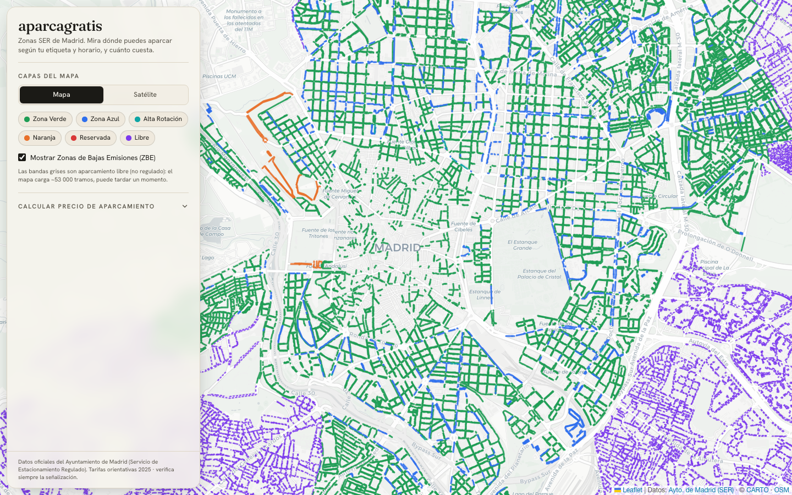
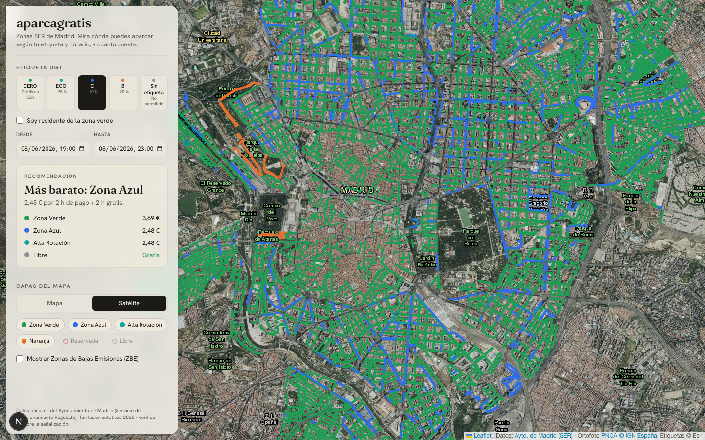

<div align="center">

# 🅿️ aparcagratis

### Mapa inteligente de las zonas SER de Madrid — descubre **dónde** puedes aparcar y **cuánto** cuesta, según tu etiqueta DGT y tu horario.

**[▶︎ Abrir la app en vivo — carlosbaraza.github.io/aparcagratis](https://carlosbaraza.github.io/aparcagratis/)**

[](https://github.com/carlosbaraza/aparcagratis/actions/workflows/deploy.yml)
&nbsp;




</div>

---

## Por qué

Aparcar en Madrid es un juego de reglas: zona **azul**, **verde**, **libre**, etiqueta
ambiental, horarios del SER que cambian por la noche y en agosto… La pregunta real nunca es
solo "¿dónde hay sitio?", sino **"¿puedo aparcar aquí a esta hora con mi coche, y cuánto me
cuesta?"**.

> 🍽️ **Ejemplo:** quieres cenar y aparcar de 19:00 a 23:30 un martes. El SER cierra a las
> 21:00 → pagas solo 2 h y las 2 h 30 min restantes son **gratis**. aparcagratis te dice la
> zona más barata y el precio exacto, al céntimo.

## Qué hace

- 🗺️ **Overlay GIS oficial** de las **87 616** bandas de aparcamiento de Madrid, coloreadas
  por tipo de zona (Verde · Azul · Alta Rotación · Naranja · Reservada · **Libre**).
- 🧮 **Motor de decisión** que combina horario SER + etiqueta DGT + tarifa por tramos + tope
  de estancia y te dice **si puedes aparcar y cuánto cuesta**, separando minutos de pago y
  gratis.
- 🟪 **Detección de calles no reguladas** (banda *libre*, en púrpura): aparcamiento gratuito.
- 🛰️ **Vista satélite** con ortofoto de alta resolución del IGN para comprobar las plazas.
- 📍 **Click en el mapa** → abrir ese punto en **Google Maps** o **Street View**.
- 🔵 **Tu ubicación GPS**: punto azul en vivo, centrado automático si estás cerca de Madrid y
  botón para recentrar.
- 📱 **Mobile-first**: navbar + menú, cajón a pantalla completa y accesos rápidos abajo.

<div align="center">


</div>

## De dónde salen los datos

Todo viene de **fuentes oficiales del Ayuntamiento de Madrid** — nada inventado ni estimado a
ojo. El script [`scripts/build-geojson.ts`](scripts/build-geojson.ts) descarga los datos del
**servicio ArcGIS REST del Geoportal** y construye los GeoJSON que consume la app:

```
https://sigma.madrid.es/hosted/rest/services/GEOPORTAL/SERVICIO_DE_ESTACIONAMIENTO_REGULADO/MapServer
```

Ficha de catálogo abierto (datos.madrid.es / Geoportal):
[Servicio de Estacionamiento Regulado (SER)](https://geoportal.madrid.es/IDEAM_WBGEOPORTAL/dataset.iam?id=9506daa5-e317-11ec-8359-60634c31c0aa).

| Capa | Contenido | Uso en la app |
|------|-----------|----------------|
| **4** | Bandas de aparcamiento (polilíneas, campo `Color`) | El overlay principal de zonas |
| **3** | Límite de barrios de la Zona SER | Contexto |
| **60–62** | ZBE / ZBEDEP (Centro, Plaza Elíptica, Madrid ZBE) | Capa de Bajas Emisiones |

Detalles técnicos relevantes:

- El dato nativo está en **EPSG:25830** (ETRS89 / UTM huso 30N); se solicita `outSR=4326`
  para recibirlo en WGS84 (lat/lon) listo para el mapa.
- La capa de bandas tiene un **límite de 2 000 registros por respuesta**, así que el script
  **pagina** con `resultOffset` hasta descargar las 87 616 geometrías.
- El campo `Color` (`Verde`, `Azul`, `Alta Rotación`, `Naranja`, `Rojo`, `Gris`) se mapea a
  un tipo de zona. **`Gris` = banda libre / no regulada** → aparcamiento gratis.
- Las **tarifas, horarios y modificadores DGT** (referencia 2025) se centralizan en un único
  archivo citado, [`src/lib/ser/tariffs.ts`](src/lib/ser/tariffs.ts), separado de la lógica
  para poder actualizarse en un solo sitio.

Los GeoJSON ya procesados viven en [`public/data/`](public/data) (versionados, para que la
app y el deploy funcionen sin pasos extra). Para regenerarlos desde el servicio oficial:

```bash
pnpm build:data
```

## Cómo funciona el motor

Toda la lógica de dominio es **pura y testeada** (`src/lib/ser`), sin dependencias del DOM:

```ts
evaluateParking({ zone: "verde", label: "b", start, end })
// → { allowed, finalCost, regulatedMinutes, freeMinutes, exceedsMaxStay, reason }
```

- **Horario SER**: L-V 9–21, sábado 9–15, agosto reducido, domingos/festivos gratis. La
  ventana de aparcamiento se reparte minuto a minuto en *de pago* vs *gratis* (gestiona el
  cruce de medianoche).
- **Etiqueta DGT**: CERO gratis · ECO −75 % · C −10 % · B +20 % · sin distintivo no permitido.
- **Tarifa por tramos**: interpolación lineal sobre la tabla oficial, con tope de estancia.

## Stack

**Next.js 16** (App Router, export estático) · **TypeScript** · **Tailwind CSS 4** ·
**Leaflet** (render canvas para 87 k geometrías) · **Vitest** + **Playwright** · datos
**ArcGIS REST** del Ayuntamiento de Madrid · basemaps **CARTO** y ortofoto **PNOA / IGN**.

## Desarrollo local

```bash
pnpm install
pnpm build:data   # solo la primera vez (descarga oficial → public/data)
pnpm dev          # http://localhost:3000
```

## Tests

Construido con **TDD**: la lógica de dominio se escribió test-first.

```bash
pnpm test       # 32 tests unitarios (Vitest, ~96 % cobertura del dominio)
pnpm coverage   # informe de cobertura
pnpm e2e        # 12 tests end-to-end (Playwright headless, incl. móvil)
```

## Despliegue (GitHub Pages)

La app es **100 % estática** — sin servidor, API routes ni SSR dinámico. Cada push a `main`
dispara [el workflow](.github/workflows/deploy.yml), que hace `next build` (`output: "export"`)
con el `basePath` del repo y publica `out/` en GitHub Pages.

```bash
NEXT_PUBLIC_BASE_PATH=/aparcagratis pnpm build   # genera ./out
```

## Arquitectura

```
src/lib/ser/        Motor de dominio (puro, testeado)
  classify.ts         Color del shapefile → tipo de zona
  schedule.ts         Reparto de la ventana en minutos de pago / gratis
  tariff.ts           Coste por tramos (interpolación lineal)
  decision.ts         Motor: ¿puedo aparcar? ¿cuánto cuesta?
  tariffs.ts          Fuente única de tarifas, horarios y modificadores DGT
  zones.ts / dgt.ts   Metadatos de presentación
src/lib/geo/        Transformación de features GIS → formato app
src/components/     App, MapView (Leaflet), ControlPanel, navbar y shortcuts móviles
scripts/            build-geojson.ts (descarga + procesado oficial)
e2e/                Pruebas Playwright
```

---

> ⚠️ **Aviso**: las tarifas son orientativas (referencia 2025) y pueden cambiar. Esta
> herramienta es informativa — **verifica siempre la señalización in situ**. Datos de
> aparcamiento © Ayuntamiento de Madrid; ortofoto © IGN España; mapa base © CARTO / OpenStreetMap.
